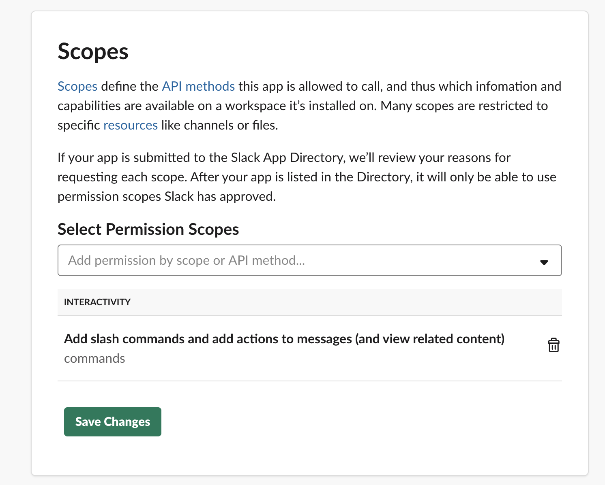
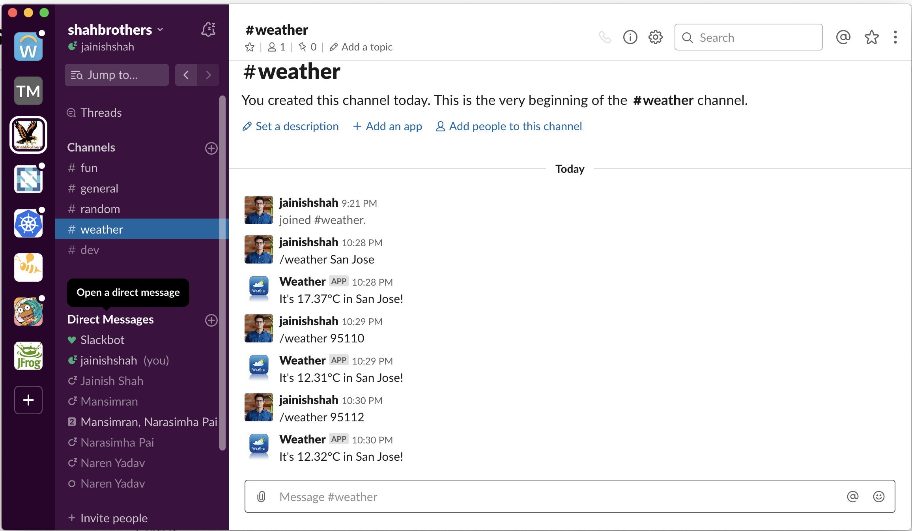

# slack-weather-bot
Slack bot to get weather details.

**Prerequisites**
* [NodeJs](https://nodejs.org/en/)
* [Ngrok](https://ngrok.com/)
* [Slack Workspace](https://slack.com/) 
* [Openweathermap Account](https://openweathermap.org/api)

# Getting started

* Checkout code:
```bash
git checkout https://github.com/jainishshah17/slack-weather-bot.git
```

* Install Npm dependencies:
```bash
cd slack-weather-bot/
npm install
```

* Create Slack App
  1. Go to https://api.slack.com/apps
  2. Create New App:
     Name: Weather
     Development Slack Workspace: Choose your workspace
  3. Add [logo](public/images/weather.jpg) and description: "Get current weather information by ZipCode."
  4. Copy `Signing Secret` and store it in [.env](.env-example) file.
  5. Go to Features -> OAuth & Permissions -> Scopes and add following permission and save changes:
  
  6. Install newly created Weather App to your workspace. 
  7. Go to Features -> OAuth & Permissions -> OAuth Tokens & Redirect URLs. <br>
     Then copy `OAuth Access Token` and store it in [.env](.env-example) file.
  8. Get and store [Openweathermap API Key](https://home.openweathermap.org/api_keys) in [.env](.env-example) file. 

* Start Weather app server
```bash
npm start
```

* Install and run Ngrok

```bash
npm install -g ngrok
ngrok http 3000

## You will see output like following
ngrok by @inconshreveable                                                                                                                                                                                                     (Ctrl+C to quit)

Session Status                online
Session Expires               7 hours, 59 minutes
Version                       2.3.35
Region                        United States (us)
Web Interface                 http://127.0.0.1:4040
Forwarding                    http://c1219f73.ngrok.io -> http://localhost:3000
Forwarding                    https://c1219f73.ngrok.io -> http://localhost:3000

Connections                   ttl     opn     rt1     rt5     p50     p90
                              0       0       0.00    0.00    0.00    0.00
```

* Create [Slash Command](https://api.slack.com/apps/) in Weather Slack App we created
    1. Go to Features -> Slash Commands -> Click on Create New Command
       Provide following details for new slash command: <br>
       Command: `/weather` <br>
       Request URL: `https://c1219f73.ngrok.io/` (**Note**:Use your ngrok generated HTTPS URL) <br>
       Short Description: `Get current weather information by City or ZipCode` <br>
       Usage Hint: `San Jose` <br>
      
    2. Go to slack and type `/weather San Jose` or `/weather 95112` to see the magic:
       
       
       
Contact me on [Twitter](https://twitter.com/jainishshah24) / [GitHub](https://github.com/jainishshah17)
    